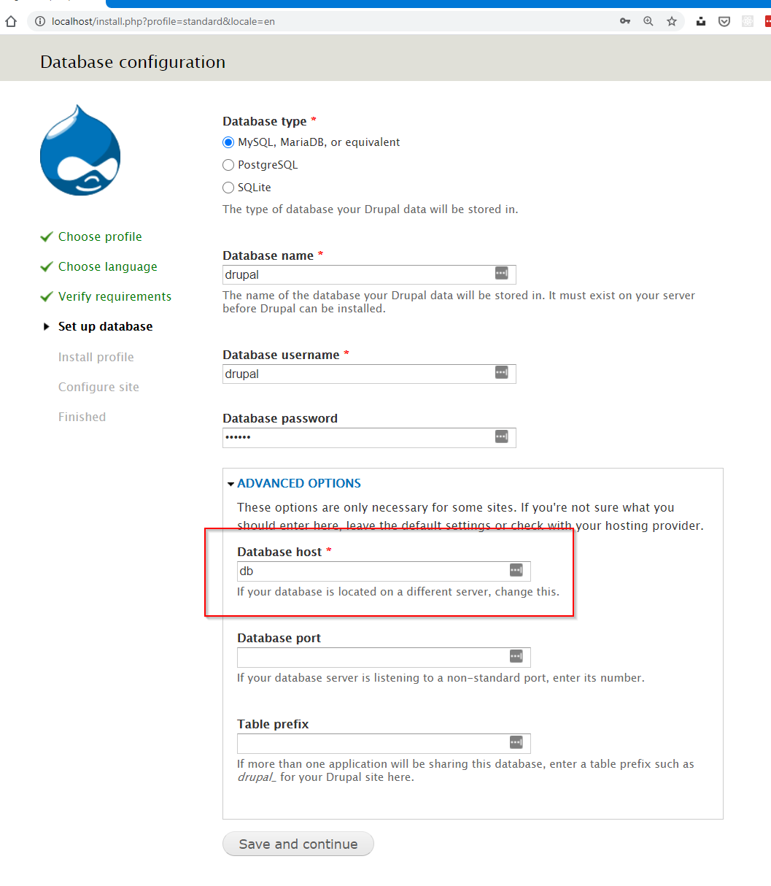
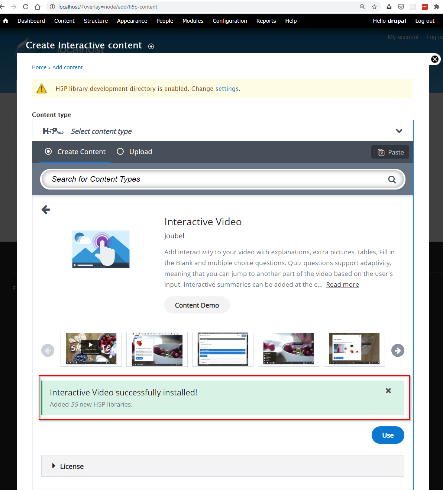
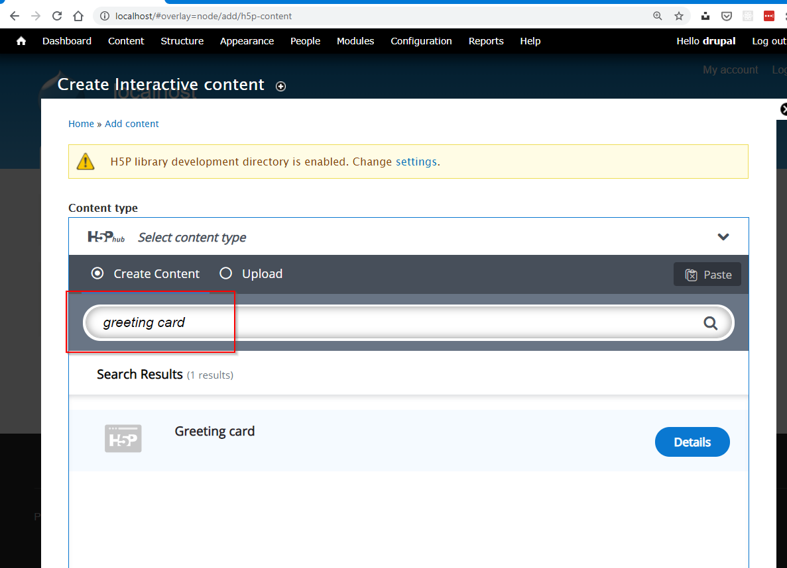

H5P Content Type development using docker-compose
-------------------

This article gives details on how to use docker-compose to spin up containers that make up a development environment for H5P Content Types.

This is a rather basic setup using only prebuilt images for drupal and mysql, and as such is surprisingly simple! The caveat is that there are a few manual steps for installation via the browser the first time we run it.

However, this setup is much more lightweight (and faster!) compared to [using full VMs with VirtualBox](https://h5p.org/development-environment-in-virtual-box).

## Prerequisites

Install [Docker Desktop](https://www.docker.com/get-started) for your platform. I'm using Windows 10 Pro and using [WSL 2](https://docs.microsoft.com/en-us/windows/wsl/install-win10) to run the latest Ubuntu (20.04 as of this writing). 

> Something that is relatively new is that Windows 10 Home edition can also run docker desktop using the WSL 2 backend. See https://docs.docker.com/docker-for-windows/install-windows-home/

### docker/getting-started

If you're completely new to using docker, I recommend going through the official Getting started guide.

Once you have docker installed, you can launch it with the following command. If you're using Docker Desktop for Windows, this exact command is thrown in your face pretty clearly when you're viewing the Docker Dashboard GUI after installing, and no containers are running.

```bash
docker run -dp 80:80 docker/getting-started
```

This will download the docker/getting-started image from Docker hub, and immediately start a new container with it, and will map port 80 on your machine to port 80 of the container. If you have another process using port 80 just change the port number in front of the colon to bind to another.

Once it's up and running, view it in your browser at http://localhost:80 (or whichever port you ended up mapping).


## Create a docker compose file

A compose file describes one or more services to be run together, each in their own container, but all connected via their own isolated network so that they can communicate (docker sets this up automagically).

Our compose file will have two services: one web server (Apache with Drupal 7), and one database server (MySQL).

Each service is described and configured, and the format used is YAML. Our compose file is rather small so the contents are probably fairly intuitive just by reading top to bottom.

But first, we'll prepare a simple folder structure that matches the volume mapping in the compose file.

```
code/
  docker-devenv/
    docker-compose.yml
  repos/
    h5p-greetingcard/
      greetingcard.css
      greetingcard.js
      library.json
      semantics.json
```

> The file contents for the h5p-greetingcard folder can be gotten from the [Hello world tutorial](https://h5p.org/tutorial-greeting-card).

Then add the following contents to docker-compose.yml:

```yml
version: "3"

services:
  drupal:
    image: drupal:7.72-apache
    ports:
      - "80:80"
    volumes:
    - ../repos:/mnt/h5pdev
    - drupal-storage:/var/www/html
  db:
    image: mysql:5.7
    volumes:
      - db-storage:/var/lib/mysql
    command: --default-authentication-plugin=mysql_native_password
    restart: always
    environment:
      MYSQL_ROOT_PASSWORD: drupal
      MYSQL_USER: drupal
      MYSQL_PASSWORD: drupal
      MYSQL_DATABASE: drupal

volumes:
  drupal-storage:
  db-storage:
```

Both services simply reference images straight from the Docker hub.

- Drupal: https://hub.docker.com/_/drupal
- MySQL: https://hub.docker.com/_/mysql

So, as soon as we run this, docker will create a network and then run two containers that are connected to it.

## Docker compose up and down

### Starting the containers

No reason to wait! Start it up with this simple command from the folder containing the docker-compose.yml file.

```bash
docker-compose up -d
```

It should give output similar to this:

<samp>
<pre>
Creating network "docker-devenv_default" with the default driver
Starting docker-devenv_drupal_1 ... done
Starting docker-devenv_db_1     ... done
</pre>
</samp>

> Remove the -d flag if you want to run in the foreground instead. Then you can stop the containers by hitting Ctrl + C.

### Stopping (and removing) the containers

The "opposite" command allows you to easily tear everything down, and actually removes both containers.

```bash
docker-compose down
```

<samp>
<pre>
Stopping docker-devenv_drupal_1 ... done
Stopping docker-devenv_db_1     ... done
Removing docker-devenv_drupal_1 ... done
Removing docker-devenv_db_1     ... done
Removing network docker-devenv_default
</pre>
</samp>

> Note that the named volumes are left intact. If you want to remove those as well, you can do so with `docker-compose down --volumes`.

You can also simply run `docker-compose stop` to leave the containers intact, but just stop them.

The thing about docker is that containers are meant to be disposable and easily reproducible, and so ideally it should be safe to simply destroy a container because you should have a compose file (or a lone Dockerfile) that let's you easily recreate it.

## Installing Drupal and setting up H5P content type development

### Introduction
So, it's important to note that our compose file and image composition leaves room for improvement because Drupal isn't actually installed yet. 

We have to run the browser based installer, and then we have to install the H5P Plugin and then enable the development folder. 

Also, once this is done, we must initialize the folders under sites/default/files/h5p by adding some content and then we can create a symbolic directory link to /mnt/h5pdev where we have mapped the source code for our content type.

### Installing Drupal

Ensure the containers are up and running

```bash
docker-compose up -d
```

If they're already running, docker handles this gracefully and simply informs you that they are up-to-date.

<samp>
<pre>
docker-devenv_drupal_1 is up-to-date
docker-devenv_db_1 is up-to-date
</pre>
</samp>

You should now be able to access drupal's web based installer at http://localhost.

> Note that we haven't mapped any ports for the MySQL container so we cannot connect to it from the host directly, but we also shouldn't currently need to.

Proceed to the "Set up database" step of the Drupal installation. Here we provide the username and password that we have configured for our db service. 

The thing to note here is that we must expand Advanced otions and supply the hostname `db` instead of localhost. Docker enables us to use this as a hostname, simply referring the name we chose in our docker-compose.yml on line 11.



The rest of the installer is self-explanatory.

### Installing the H5P plugin

Locate the latest Drupal 7 plugin at the bottom of the following page https://www.drupal.org/project/h5p. 

Copy the URL for the tar.gz. It is https://ftp.drupal.org/files/projects/h5p-7.x-1.46.tar.gz as of July 15 2020.

Navigate to http://localhost/admin/modules/install and paste the URL in the "Install from URL" input, then click Install.

Upon successful installation, click "Enable newly installed modules", then scroll to the bottom of the page to enable *H5P* and *H5P Editor*.

Upon saving you will get an error message saying that the PHP max upload size is quite small (2 MB). We'll ignore this for now.

### Enabling H5P development mode and development folder

Navigate to Configuration > System > H5P (http://localhost/admin/config/system/h5p) and then check the two checkboxes labelled *Enable H5P development mode* and *Enable library development directory*.

Then, navigate to the front page and add new content > interactive content. Pick any of the available content types, and click *Get*.



This will initialize all the subfolders of sites/default/files/h5p including the development folder which we will now overwrite with a symbolic link.

### Overwriting development folder with a symbolic link

In our docker compose file we mapped ../repos to /mnt/h5pdev. We want this folder to be our development folder, and we accomplish this by simply creating a symbolic directory link to it.

This is done from inside the container, and in order to launch a shell inside a running container we can use `docker exec`, but we must know the name or ID of our container.

Run the following command to see all containers.

```bash
docker ps
```
The last column, *NAMES*, is a human-friendly name for each container that can be used with various commands.

```bash
docker exec -it docker-devenv_drupal_1 bash
```

This should give you a bash session as root inside the container. The current directory should be /var/www/html.

Here's what we need to do:

```bash
cd /var/www/html/sites/default/files/h5p
mv development development-old
ln -s /mnt/h5pdev/ development
```

If you filled the h5p-greetingcard files then you should now be able to add new content and find the Greeting Card content type.



If you did, then we're done!

You can now hack away inside the repos folder on your machine and the contents will be available inside the container.

## Final note on volumes and persistence

We use so called named volumes to persist the contents of /var/www/html of the drupal container, and /var/lib/mysql of the mysql container. This means that the drupal installation and configuration will be persisted as long as we don't remove the volumes.

If we remove the volumes, we will have to reinstall drupal and the plugin etc all over. 

## Conclusion

There are many steps here that can probably be automated further with a more specialized Dockerfile.